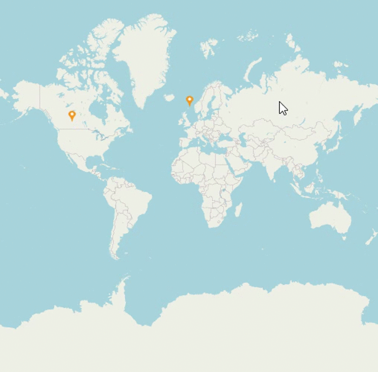

# How-to-dynamically-add-the-map-marker-at-tapped-location
This demo sample describes How to add the markers dynamically at the tapped location in Xamarin.Forms maps (SfMaps)

 
 
## Creating the above UI

Above use case has been achieved by using the below code snippet

[XAML]

```
    <maps:SfMaps  x:Name="sfMaps" Tapped="sfMaps_Tapped">
        <maps:SfMaps.Layers>
            <maps:ImageryLayer LayerType="OSM" x:Name="layer">
                <maps:ImageryLayer.MarkerTemplate>
                    <DataTemplate>
                        <Image x:Name="markerImage" HorizontalOptions="Center"     Source="pin.png"    VerticalOptions="Center" HeightRequest="15" WidthRequest="15"/>
                    </DataTemplate>
                </maps:ImageryLayer.MarkerTemplate>
            </maps:ImageryLayer>
        </maps:SfMaps.Layers>
    </maps:SfMaps>

```

[C#]

```
        private void sfMaps_Tapped(object sender, MapTappedEventArgs e)
        {
            var screenPoint = e.Position;
            var geoPoint = layer.GetLatLonFromPoint(screenPoint);
            MapMarker marker = new MapMarker();
            marker.Latitude = geoPoint.Y.ToString();
            marker.Longitude = geoPoint.X.ToString();
            layer.Markers.Add(marker);
        }

```

## See also

[How to populate Data in Xamarin Maps (SfMaps)](https://help.syncfusion.com/xamarin/maps/populatedata)

[How to add the Layers in Xamarin Maps (SfMaps)](https://help.syncfusion.com/xamarin/maps/layers)

[How to add the different shapes in Xamarin Maps (SfMaps)](https://help.syncfusion.com/xamarin/maps/shapetype)

[How to add the markers in Xamarin Maps (SfMaps)](https://help.syncfusion.com/xamarin/maps/markers)

[How to add the sublayers in Xamarin Maps (SfMaps)](https://help.syncfusion.com/xamarin/maps/sublayer)
